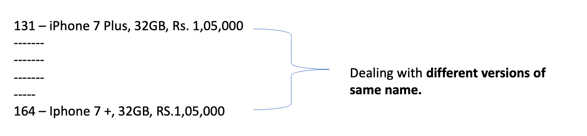

# Surprisingly Effective Way To Name Matching In Python

            

These are the same product types but were taken as different forms, i.e., deal with different versions of same name.

**In this workbook, we will deal with matching the different versions of one name for product types so that we can create a master record for further analysis.**

This scenario has a name called **data matching or fuzzy matching (probabilistic data matching) or simply data deduplication or string/ name matching.**

**Detail Explanation:** [Surprisingly Effective Way To Name Matching In Python](https://medium.com/@maladeep.upadhaya/surprisingly-effective-way-to-name-matching-in-python-1a67328e670e)

